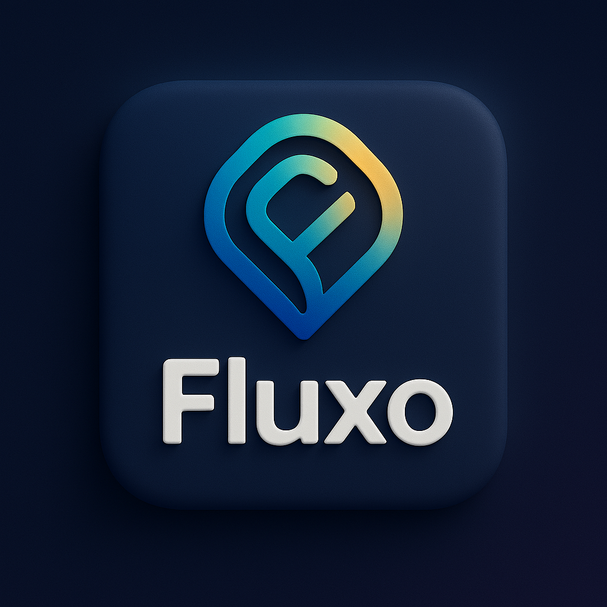

# 📘 Documentação Oficial do Fluxo

Bem-vindo à central de documentação do **Fluxo**, o aplicativo de eventos com mapa interativo, fórum de eventos e identidade descentralizada via blockchain.

---

## 🧭 Comece por aqui

- [Resumo e Interface (README)](./README.md)
- [Visão Técnica Geral (DOCUMENTATION)](./DOCUMENTATION.md)
- [Regras e Estratégia (REGRAS)](./REGRAS.md)
- [Estrutura do Backend (.NET) (INFRA)](./INFRA.md)
- [Funcionalidades e Modelos de Dados (CODES)](./CODES.md)
- [Design, Usabilidade e UI (USABILIDADE)](./USABILIDADE.md)
- [Roadmap e MVP (MVP)](./MVP.md)
- [Plano de Orçamento (CUSTOS)](./CUSTOS.md)
- [Funcionalidades e ideias (FEATURES)](./FEATURES.md)

---

## 📌 Sobre o Fluxo

Fluxo é uma rede social federada e geolocalizada para eventos, com base em:
- Interação via mapa e fóruns como nos antigos eventos do Facebook
- Identidade única e antifraude via blockchain
- Criação e descoberta de eventos públicos e privados
- Incentivo à ocupação urbana e à descentralização digital

---

---
**Para sugestões ou contribuição**, abra uma [Issue](https://github.com/AmoreiraT/fluxo/issues) ou envie um Pull Request.

